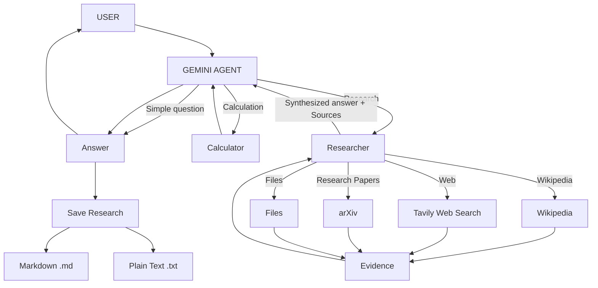

# Personal Research Agent

A research agent built with Python, Gemini, LangChain, and LangGraph.

The goal of this project is to understand how AI agents work by building one step by step — starting with tool calling and gradually adding multiple research sources, state management, source tracking, citations, and research workflows.

## Architecture



## What It Can Do

The system consists of two agents:

- **Main Agent** — handles user requests, answers directly when possible, performs calculations, and delegates research tasks
- **Research Agent** — investigates topics using the selected research sources and produces a synthesized answer

The system supports:

- Direct question answering
- Mathematical calculations
- Wikipedia research
- Tavily web research
- arXiv research papers
- Local file research (TXT, MD, PDF, DOCX)
- User-controlled source selection
- Markdown and plain-text research export

## Tech Stack

* Python
* Gemini
* LangChain
* LangGraph
* Tavily
* Wikipedia
* arXiv
* uv

## Project Structure

```text
personal-research-agent/
│
├── graph.py
│
├── tools/
│   ├── __init__.py
│   ├── calculator.py
│   ├── wikipedia.py
│   ├── web.py
│   ├── arxiv.py
│   ├── files.py
│   └── save_research.py
│
├── research/
│
├── .env
├── .gitignore
├── pyproject.toml
├── uv.lock
└── README.md
```

## Environment Variables

Create a `.env` file:

```text
GEMINI_API_KEY=YOUR_KEY
TAVILY_API_KEY=YOUR_KEY
```

Never commit `.env` or expose API keys.

## Run

```bash
uv run graph.py
```

## Roadmap

The next stages are ordered based on what will be built next, with each stage building on the previous one.

1. **File-based RAG**
   - Add semantic retrieval for local documents using chunking, embeddings, and vector search.
   - Improve the existing file research capability beyond keyword-based retrieval.

2. **File Upload**
   - Allow users to upload documents directly to the research agent.
   - Connect uploaded documents to the file-based RAG pipeline.

3. **Advanced Research Planning**
   - Allow the researcher to break complex questions into multiple research steps.
   - Plan what information needs to be gathered before starting the investigation.

4. **Advanced Evidence & Citations**
   - Ground claims in retrieved evidence.
   - Evaluate source reliability and evidence quality.
   - Detect conflicting information between sources.
   - Improve citation accuracy and make it clear which sources support each claim.

5. **Parallel Research**
   - Research multiple independent sub-questions or sources concurrently.
   - Combine the retrieved evidence before synthesis.

6. **Conversation-Aware Research**
   - Use previous conversation and research context for follow-up questions.
   - Avoid repeating research when existing evidence is still relevant.

7. **Structured Research Reports**
   - Generate structured reports containing summaries, findings, evidence, and sources.

8. **Research History**
   - Store previous research sessions and allow them to be retrieved later.

> Under development. All rights reserved to [Abheeshta-P](https://github.com/Abheeshta-P).
